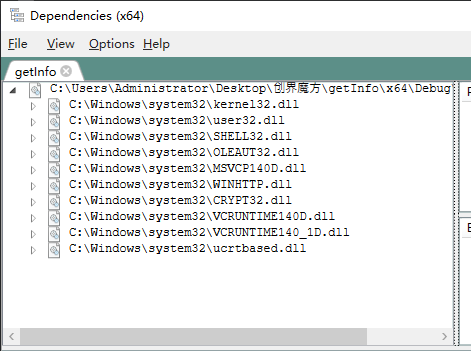

DLL依赖环境,release环境可放在同级目录

快速测试方法 1编译项目 2可直接创建控制台应用,调用DLL中的monitorLOL() 

监视LOL信息功能 入口为monitor.cpp中的monitorLOL方法 , 后续可在当前方法中检测所有游戏

LOL监视分为3个部分. 1.游戏对局中监视(监视连杀超神等,其中超神没有直接查询的接口,只能通过算法实现,连杀超神根据evenID防止掉线后重复触发) 2.游戏对局前客户端阶段(监视玩家段位,开黑情况,区服等,这些信息以全局变量存储以便在对局中提取) 3.游戏结束后统计战绩信息(这个不能做到游戏中实时查询,因为无法判断是否掉线重开等异常情况,需要通过gameId查询,可能需要多开一个线程)

单元测试可修改 test00(int a, int b)的实现.以便单独测试.

现监视中会单独分离一个线程,监视游戏运行状态

现目前已测试 实现为主.封装优化冗余代码可在需求基本实现后进行.

http通信与后端约定的是同步发送,后端处理异常

日志文件放在运行目录下: monitor.log 现主要测试运行中的获取的信息是否正确.

# 后端接口设计:
## barClient上传游戏数据
### message PostGameDataReq {
  // 机位号
  string computer_no = 1;
  // 活动名称:LOL=LOL游戏(固定值)
  string name = 2;
  // 对局游戏唯一标识符号
  string game_uuid = 3;
  // 事件id
  string event_id = 4;
  // 游戏模式:MATCH=匹配,SINGLE_AND_DOUBLE=单双排,FREE_GROUP=灵活组排,SUPER_SMASH_BROTHERS=极地大乱斗,UNLIMIT_FIRE=无限火力,ULTIMATE_HIT=极限闪击,GOD_TREE=神木之门
  string game_mode = 4;
  // 队伍人数:ONE=单人,TWO=双人,THREE=三人,FOUR=四人,OVER_FOUR=四人以上
  string team_size = 5;
  // 段位:UNLIMIT=不限制(空段位),ZUI_QIANG_WANG_ZHE=最强王者,AO_SHI_ZONG_SHI=傲世宗师,CHAO_FAN_DA_SHI=超凡大师,ZUAN_SHI=钻石,FEI_CUI=翡翠,BO_JIN=铂金,HUANG_JIN=黄金,BAI_YIN=白银,QING_TONG=青铜,HEI_TIE=黑铁
  string user_game_rank = 6;
  // 达成条件key:RUN=客户端打开,KILL=客户端关闭,SAN_SHA_SHU=三杀数,SI_SHA_SHU=四杀数,WU_SHA_SHU=五杀数,CHAO_SHEN_SHU=超神数,END=游戏结束
  string type = 7;
  // 其他数据:type=END游戏结束 需要传
  message Data {
    // 人头数
    int32 ren_tou_shu = 1;
    // 助攻数
    int32 zhu_gong_shu = 2;
    // 补兵数
    int32 bu_bing_shu = 3;
    // 排眼数
    int32 pai_yan_shu = 4;
    // 胜利状态:0=输,1=赢
    int32 win = 5;
    // 时长(秒)
    int32 time = 6;
    // 成员信息
    message Member {
      // id
      string id = 1;
      // 角色:self,team,other
      string role = 2;
    }
    repeated Member member = 7;
  }
  string data = 8;
}

## 语音播报接口:
### message GameLolLoginReq {
  // 机位号(坐在XX号机的玩家，是来自XX区的XX（超凡大师），祝您心情愉快，玩得开心)
  string computer_no = 1;
  // 地区
  string area = 2;
  // 段位()
  string pos = 3;
}
